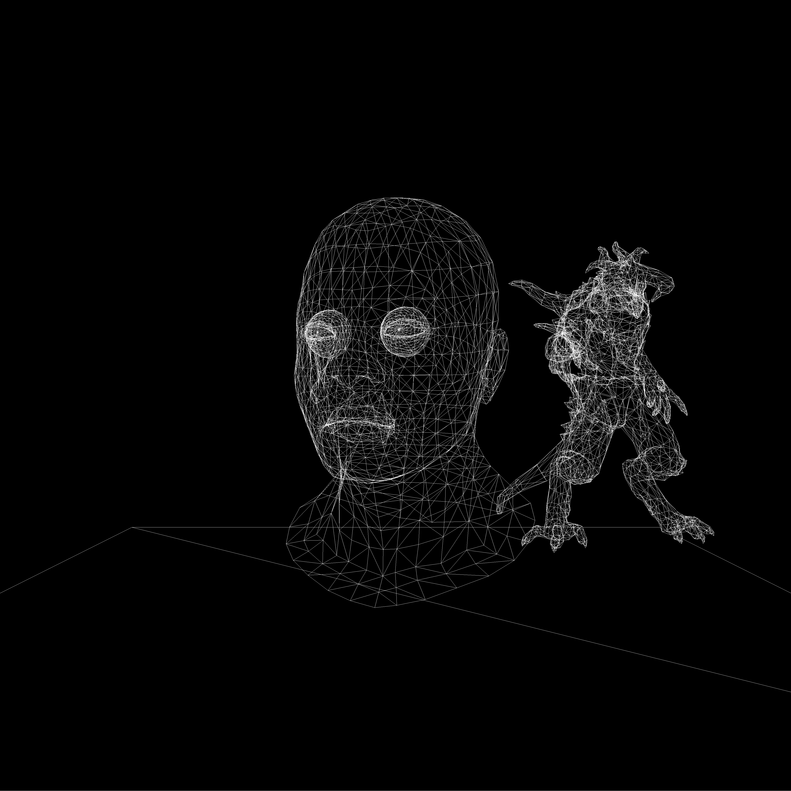
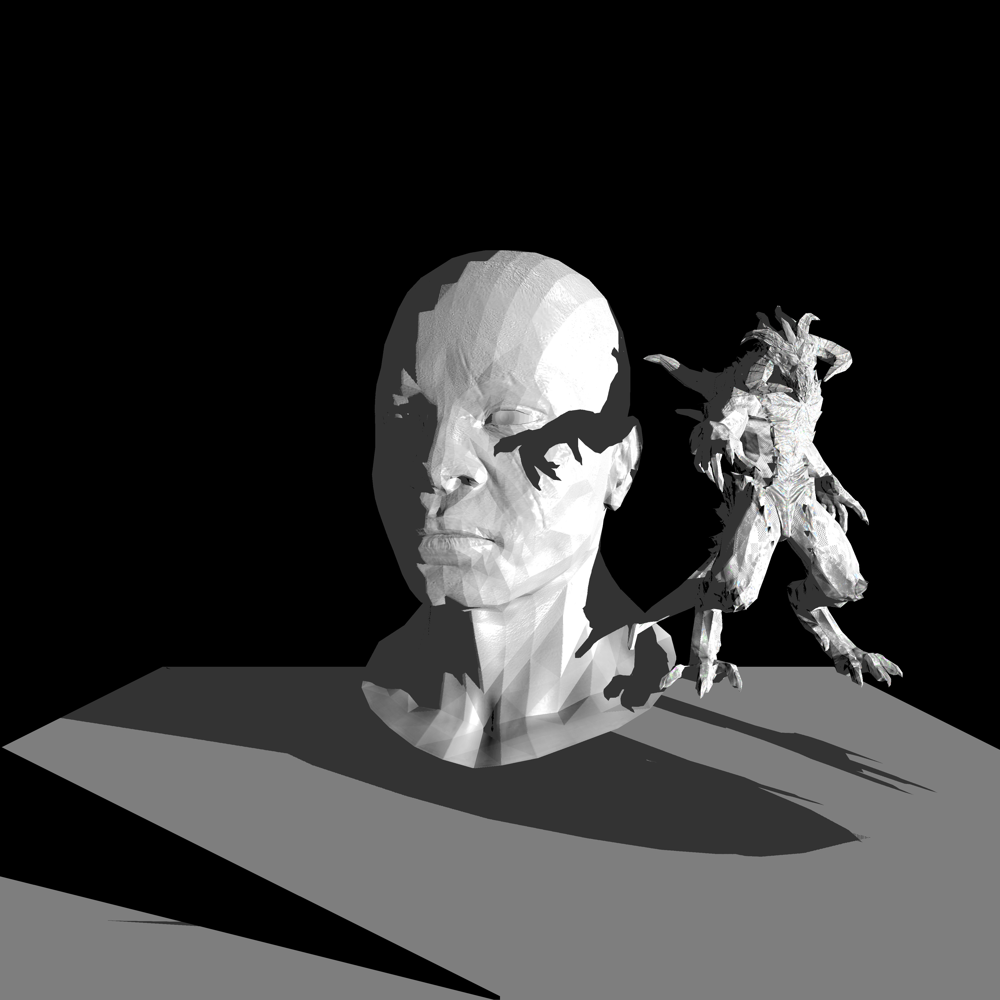
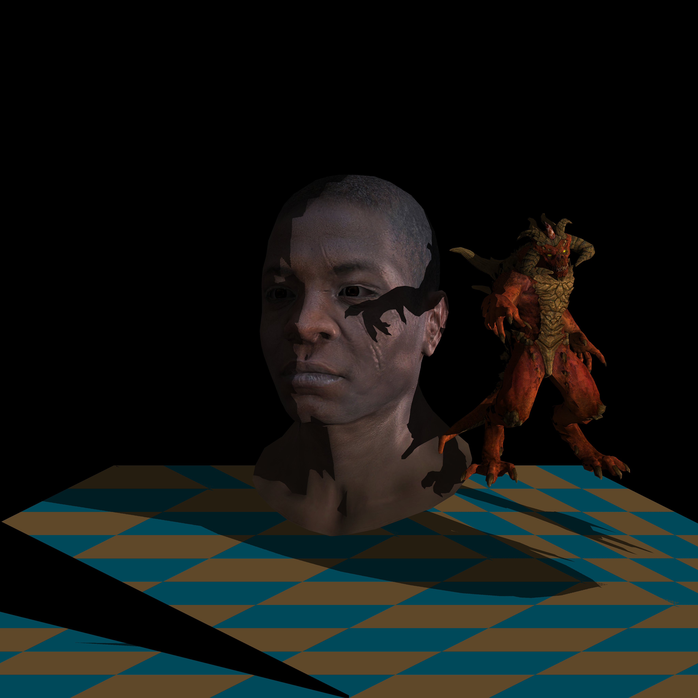

# fst_m1_moteur3d

Ce projet est un moteur 3D réalisé dans le cadre de l'UE *Fonctionnement d'un moteur de rendu 3D* du Master 1 Informatique
de l'Université de Lorraine, dispensée par [Dmitry Sokolov](https://github.com/ssloy).
Le développement a été réalisé en suivant les explications de son wiki [TinyRenderer](https://github.com/ssloy/tinyrenderer).

Les fichiers .obj et les textures associées sont issues de ce même repository.
Les fichiers [tgaimage.h](./tgaimage.h) et [tgaimage.cpp](./tgaimage.cpp) nous ont été fournis par M. Sokolov.

> [!NOTE]
> Le programme sort uniquement des images TGA.
> Les images dans [out](./out) ont été converties en JPG afin d'être visibles directement sur GitHub.

## Compilation
```bash
mkdir build
cd build
cmake ..
make
```

* [**glm**](https://github.com/g-truc/glm.git) est nécessaire.
S'il n'est pas présent sur votre machine, cmake le téléchargera automatiquement.
* Si **OpenMP** est installé sur votre machine, vous profiterez du multi-threading.
(Mise en pratique du cours d'*Algorithmique Parallèle* de M1, de M. Contassot-Vivier)

## Exécution
Donner en paramètre un fichier de scène (comme [african_head.scene](./obj/african_diablo.scene)) ou directement un fichier .obj (comme [african_head.obj](./obj/african_head.obj)).

```bash
fst_m1_moteur3d ../obj/african_diablo.scene
```

Des paramètres sont disponibles pour activer ou désactiver certaines fonctionnalités du programme.

Pour plus d'informations, exécutez la commande suivante :
```bash
fst_m1_moteur3d --help
```

### Exemples
```bash
fst_m1_moteur3d ../obj/african_diablo.scene -w:1
```
donne :

Le paramètre `-w:1` active le mode wireframe (affichage des triangles en fil de fer).

```bash
fst_m1_moteur3d ../obj/african_diablo.scene -d:0 -g:0
```
donne :

Les paramètres `-d:0` et `-g:0` désactivent respectivement la texture diffuse et le shading de Gouraud.


## Résultat
J'ai fait la plupart des étapes du wiki. Je ne suis pas passé aux shaders, car je n'ai pas totalement compris comment
ça fonctionne, et mon code marche, un peu peur de tout casser.
Je n'ai pas non plus fait l'occlusion ambiante, car je ne parvenais pas à obtenir un résultat correct.

J'ai utilisé *glm* pour simplifier l'écriture des calculs sur les matrices et les vecteurs.

Je me suis aidé des sites suivants pour comprendre les matrices Model, View et Projection :
* https://learnopengl.com/Getting-started/Coordinate-Systems
* http://www.opengl-tutorial.org/

En prenant pour exemple le fichier [african_diablo.scene](./obj/african_diablo.scene).

Résultat obtenu :


Les problèmes encore présents :
- Les yeux ne s'affichent pas correctement (outer est devant inner). J'ai commenté *outer* dans le fichier de scène pour que *inner* soit visible.
- [Technical difficulties: linear interpolation with perspective deformations](https://github.com/ssloy/tinyrenderer/wiki/Technical-difficulties:-linear-interpolation-with-perspective-deformations),
on peut voir que la texture au sol n'est pas correcte. Je ne parviens pas à résoudre ce problème.
- Probablement un souci avec mes normales : si on désactive la normalMap (paramètre `-n:0`), le sol est tout noir sauf sur les zones qui doivent être ombrées
- L'ombre sur le front d'*african_head* n'est pas lisse.

## Scènes et objets
### Objets et textures
Les objets doivent être au format [Wavefront .obj](https://wikipedia.org/wiki/Wavefront_.obj_file).

Les textures doivent être au format [Truevision TGA](https://wikipedia.org/wiki/Truevision_TGA). Le fichier de sortie sera également en TGA.
Les textures doivent être placées dans le même répertoire que le fichier obj.
Elles sont optionnelles, mais sont automatiquement chargées si elles ont le même nom que l'objet.
Pour `<mon_obj>.obj`, les textures doivent être nommées :
- `<mon_obj>_diffuse.tga` pour la texture diffuse.
- `<mon_obj>_nm_tangent.tga` pour la normal map.
- `<mon_obj>_spec.tga` pour la texture spéculaire.

> [!WARNING]
> [tgaimage.cpp](./tgaimage.cpp) a été modifié. En récupérant la couleur d'un pixel sur une image en nuances de gris,
> les 3 composantes RGB sont désormais égales à la valeur du pixel (R=G=B=value), et plus seulement la composante bleue
> (R=G=0, B=value), comme c'était le cas dans le fichier original de M. Sokolov.

### Scènes
Il est possible de charger plusieurs objets dans une même scène. Pour cela, il suffit de les ajouter dans
le fichier de scène, en respectant la syntaxe suivante :
```
LIGHT <x> <y> <z>
EYE <x> <y> <z>

FILE=<path/to/obj/file1>
<transformations>
FILE=<path/to/obj/file2>
<transformations>
...
```

Les lignes `LIGHT` et `EYE` sont facultatives.
- `LIGHT` permet de définir la position de la source de lumière.
- `EYE` permet de définir la position de l'observateur.
- `FILE` permet de charger un objet. Les chemins relatifs sont à partir du répertoire où se trouve le fichier de scène.

Les transformations sont optionnelles et s'appliquent au dernier objet chargé. Elles peuvent être de trois types :
- `.rotate <axe> <angle>` : rotation de l'objet autour de l'axe donné (x=0, y=1, z=2), d'un angle donné en degrés.
- `.translate <x> <y> <z>` : translation de l'objet de x, y et z.
- `.scale <x> <y> <z>` : mise à l'échelle de l'objet selon les axes x, y et z.

Vous pouvez consulter le fichier [african_diablo.scene](./obj/african_diablo.scene) pour un exemple de scène.
